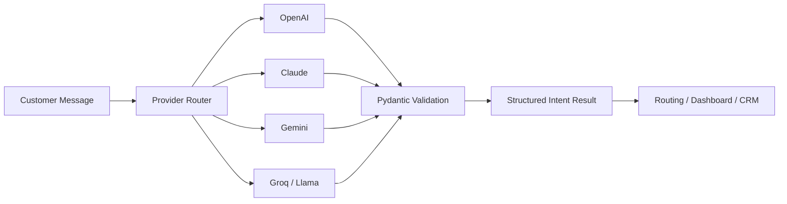

# Multi-Provider AI Support Ticket Classifier

A portfolio-ready GenAI mini project that compares multiple LLM providers for a saas customer-support use case and classifies customer messages into structured, validated outputs.

This project started from an AI Agent / GenAI lab and was refactored into a clean GitHub project with reusable Python modules, CLI commands, sample outputs, and a production-style fallback pattern.

---

## What this project demonstrates

- Multi-provider LLM integration: OpenAI, Anthropic Claude, Google Gemini, and Groq / Llama
- Side-by-side comparison of response quality, latency, token usage, and model behavior
- Structured output extraction using Pydantic models
- Customer intent classification for customer support tickets
- Fallback design when the primary provider fails
- Portfolio-friendly project structure suitable for GitHub, LinkedIn, and interviews

---

## Business scenario

A retail saas support team receives thousands of customer messages every day. Before routing each message to a support queue, the system needs to understand:

- What is the customer's intent?
- How urgent is the issue?
- What is the customer's sentiment?
- Which important entities are present?
- What should the support agent do next?

Example message:

```text
I canceled my Pro subscription last week, but I was charged $129.99 for an annual renewal today. Please reverse the charge and confirm my plan is canceled.
I don't recognize the merchant 'Pro subscription renewal Online' and I never authorized this transaction.
My card was in my possession the whole time. Please help me resolve this immediately.
```

Expected structured output:

```json
{
  "category": "billing_dispute"
  "urgency": "critical",
  "sentiment": "angry",
  "entities": ["$129.99", "Pro subscription", "annual renewal", "cancellation"],
  "summary": "Customer reports being charged for an annual renewal after canceling their Pro subscription and requests a refund confirmation.",
  "recommended_action": "Initiate a high-priority fraud dispute workflow and escalate to the fraud team."
}
```

---

## Architecture



---

## Project structure

```text
multi-provider-ai-support-classifier/
├── README.md
├── .env.example
├── .gitignore
├── pyproject.toml
├── requirements.txt
├── app.py
├── examples/
│   └── sample_messages.json
├── outputs/
│   └── sample_results.json
├── docs/
│   ├── architecture.md
│   ├── interview_notes.md
│   └── linkedin_post.md
├── notebooks/
│   └── Lab_01_Multi_Provider_LLM_Setup_Clean.ipynb
├── src/
│   └── ai_support_classifier/
│       ├── __init__.py
│       ├── cli.py
│       ├── config.py
│       ├── fallback.py
│       ├── json_utils.py
│       ├── mock_provider.py
│       ├── prompts.py
│       ├── providers.py
│       └── schemas.py
└── tests/
    ├── test_json_utils.py
    └── test_schemas.py
```

---

## Setup

### 1. Clone the repository

```bash
git clone https://github.com/<your-github-username>/multi-provider-ai-support-classifier.git
cd multi-provider-ai-support-classifier
```

### 2. Create a virtual environment

```bash
python -m venv .venv
```

Windows:

```bash
.venv\Scripts\activate
```

macOS / Linux:

```bash
source .venv/bin/activate
```

### 3. Install dependencies

```bash
pip install -r requirements.txt
pip install -e .
```

### 4. Configure API keys

Copy the sample environment file:

```bash
cp .env.example .env
```

Add only the keys you want to test:

```env
OPENAI_API_KEY=your_openai_key
ANTHROPIC_API_KEY=your_anthropic_key
GEMINI_API_KEY=your_gemini_key
GROQ_API_KEY=your_groq_key
```

Never commit `.env` to GitHub.

---

## Run the project

### Mock mode, no API keys required

```bash
python -m ai_support_classifier.cli classify --provider mock --message "I received an verification code I did not request. Please help immediately."
```

### Classify with OpenAI

```bash
python -m ai_support_classifier.cli classify --provider openai --message "I want to dispute a charge of $129.99 from Pro subscription renewal Online."
```

### Compare all configured providers

```bash
python -m ai_support_classifier.cli compare --message "I need to block my debit card immediately. I think it was stolen."
```

### Run fallback classification

```bash
python -m ai_support_classifier.cli fallback --message "I received an verification code I did not request. Someone may be trying to access my account."
```

### Run the optional Streamlit UI

```bash
streamlit run app.py
```

---

## Sample output

```json
{
  "category": "fraud_report",
  "urgency": "critical",
  "sentiment": "negative",
  "entities": ["verification code", "account access"],
  "summary": "Customer received an verification code they did not request and suspects unauthorized account access.",
  "recommended_action": "Escalate to fraud team, advise customer not to share verification code, and secure the account immediately."
}
```

---

## Interview explanation

> I built a Multi-Provider AI Support Ticket Classifier scenarios. The system compares OpenAI, Claude, Gemini, and Groq for the same customer messages, measures latency and token usage, and returns schema-validated outputs using Pydantic. I also implemented a fallback pattern so that if one provider fails, another provider can continue the classification workflow. This helped me understand how production GenAI systems need validation, routing, observability, and resilience — not just prompt writing.

---

## Notes

- This is a learning and portfolio project, not a production saas support system.
- Do not send real customer PII, account numbers, card numbers, or secrets to external models.
- Model names, pricing, and SDK behavior may change. Keep dependencies and model names configurable in `.env`.

---

## License

MIT License
